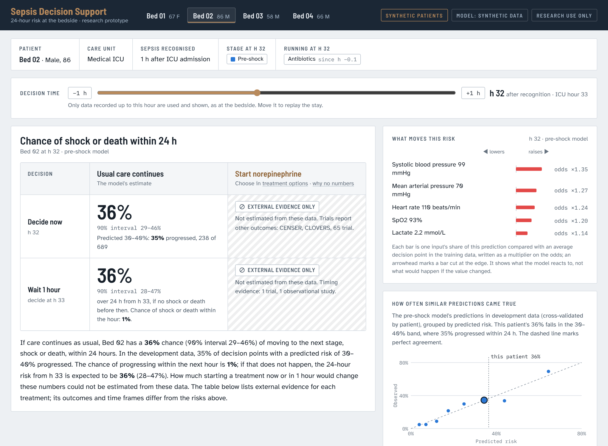
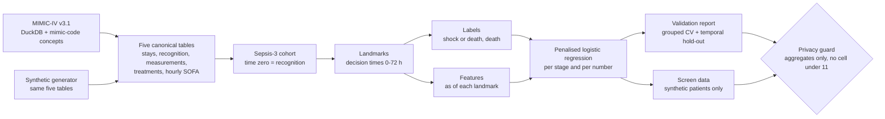

# Sepsis Decision Support

Calibrated 24-hour deterioration risk for ICU patients with sepsis, built on MIMIC-IV, checked the way a hospital would check it, and shown on a screen that says what the data can and cannot answer.



**Status: v0.1.** The pipeline runs end to end on synthetic data. On the open MIMIC-IV demo, the same SQL, cohort, labels and features run in CI (the demo's 100 patients are too few to fit the models). Results on the full MIMIC-IV database arrive in v0.2. Research use only; not a medical device.

**Screen:** [jhoonyum.github.io/sepsis-decision-support](https://jhoonyum.github.io/sepsis-decision-support/) (synthetic patients).

## The question and the honest answer

At the bedside the question is: *how likely is this patient to get worse, and would starting a treatment now rather than in an hour change that?* The screen keeps that question's shape, a two-by-two table of "decide now / wait one hour" against "usual care / start a treatment", and fills each cell with what the data can support.

| | Usual care continues | Start a treatment |
|---|---|---|
| **Decide now** | Risk of the next stage within 24 h, with a 90% interval and how often similar predictions came true | What trials found, on their own outcomes and time frames |
| **Wait 1 hour** | Chance of progressing within the hour, and the 24-hour risk from then if it does not happen | Timing evidence, or why there is none |

The left column comes from a validated prediction model. The right column holds no model number on purpose: in ICU records, treatments follow how ill a patient looks, so these data cannot separate the effect of starting a treatment from the reason it was started. [docs/design_rationale.md](docs/design_rationale.md) explains each choice.

"Next stage" depends on where the patient is:

- **Pre-shock** (not in shock, not on a vasopressor): shock or death. Shock is defined from physiology alone (sustained mean arterial pressure below 65 mmHg with lactate above 2 mmol/L), so the outcome does not depend on a clinician's decision to start a vasopressor.
- **Shock stage** (on a vasopressor, or met the shock definition earlier): death.

## How it works



- **Cohort.** Adults on their first ICU stay with Sepsis-3 recognised within 24 hours of admission, excluding cardiac and thoracic surgery services. Time zero is the moment every Sepsis-3 criterion was on record (or ICU admission, if that came later), so no patient is selected on information from their future.
- **Decision times.** Each patient contributes one row per decision time (every 3 hours over the first day after time zero, then less often up to 72 hours) while still alive and in the ICU. Features use only data recorded up to that moment; a test deletes everything recorded after each decision time and checks that no feature changes.
- **Model (D1).** Penalised logistic regression on the stacked decision times, one per stage and per number (24-hour risk now, next hour, 24-hour risk from one hour on). Intervals come from patient-level bootstrap refits; the risk drivers are each input's contribution to the log-odds.
- **Next (v0.3).** A Bayesian continuous-time hidden Markov model (B1) is compared with D1 under a rule written before the comparison.

## Validated the way a hospital would

The evaluation report covers what a health-system review asks for, not just AUROC:

- discrimination (AUROC, AUPRC) and calibration (intercept, slope, integrated calibration index), with patient-level bootstrap intervals, and calibration tables and curves;
- patient-grouped 5-fold cross-validation, plus a temporal hold-out on the most recent admission years;
- comparison with the SOFA and NEWS2 bedside scores, each recalibrated on the same training folds;
- decision curves (net benefit);
- alert burden when scored hourly: alerts per 100 patient-days, positive predictive value, events caught, alerts per detected event and lead time;
- performance by sex, age band, race and ethnicity, and care unit, and by era (drift), as point estimates.

An example report on synthetic data is in [reports/synthetic-v0.1](reports/synthetic-v0.1/evaluation_report.md). Every number in the reports is written by code from the run's JSON output.

## Quick start (no credentials needed)

```bash
mamba env create -f environment.yml && conda activate sepsis_hmm
make setup         # pinned packages and this package
make test          # unit tests on generated data
make synth         # full run on 2,000 synthetic stays (a few minutes on a laptop)
make screen RUN=synthetic-default
make serve         # http://localhost:8000
```

`make demo-data demo-check` downloads the open MIMIC-IV demo, builds it with mimic-code, and runs the same SQL, cohort rules, labels and features the real data goes through. CI does this on every push to `main` and on every pull request.

## Real data (MIMIC-IV v3.1)

MIMIC-IV requires a credentialed PhysioNet account, CITI training and a signed data use agreement. The data stays on the analyst's own computer. [docs/data_governance.md](docs/data_governance.md) gives the download and build steps and the rules this project follows.

```bash
conda activate sepsis_hmm       # includes the DuckDB CLI 1.4.4 and wget
# download MIMIC-IV v3.1 and build ~/physionet/mimic4.db (docs/data_governance.md)
make mimic-check                # aggregate counts only
make mimic                      # full run; the run folder stays outside the repository
```

## Data protection

- No record-level MIMIC-IV data leaves the analyst's computer, and none is sent to online services.
- Everything published passes `privacy/aggregate_guard.py`: no record identifiers, no per-patient lists, no count below 11, and no rate whose count or complement is below 11. Small calibration bins and cohort steps are merged with their neighbours, and a second group is hidden in any subgroup table where one is, so a hidden cell cannot be worked out from the others. Links between different tables are checked by hand before each release.
- `scripts/guard_data_files.py` refuses data files, notebooks and large files in CI and, once installed with `pip install pre-commit && pre-commit install`, before every commit.
- The screen shows synthetic patients only. From v0.2 they are scored by the model fitted on MIMIC-IV; its coefficients are aggregates.

## Repository layout

```
configs/default.yaml            every setting, with units in the names
src/sepsis_decision_support/
    data/                       canonical tables, SQL for mimic-code DuckDB, synthetic generator
    cohort/                     cohort rules, time zero, landmarks
    outcomes/                   treatment-independent shock, labels
    features/                   predictors as of each landmark
    models/                     D1 landmark model, SOFA and NEWS2 baselines
    evaluation/                 metrics, alert burden, report runner, Markdown report
    decision_support/           screen data export, external evidence table
    privacy/                    aggregate guard
    visualization/              report figures
    cli.py                      sepsis-support run | extract-check | web-export | check-privacy
web/                            the decision-support screen (static, GitHub Pages)
scripts/                        demo build, screen check, file guard
tests/                          unit tests; SQL tests on the open demo
docs/                           design rationale, prototype lessons, data governance,
                                decisions, model card, sources
```

## Roadmap

| Release | Content |
|---|---|
| v0.1 | Pipeline on synthetic data, SQL on the open demo in CI, validation report module, screen, documentation |
| v0.2 | First MIMIC-IV results: cohort flow, D1 for 24-hour progression and 28-day death, SOFA and NEWS2 baselines, full validation report, completed model card |
| v0.3 | Bayesian continuous-time HMM (B1), compared with D1 under a pre-registered rule |
| v1.0 | Technical report and a short demo video |

## Origin

This project started as a course team project on sepsis progression. The code here is an independent rewrite; [docs/prototype_lessons.md](docs/prototype_lessons.md) lists what the prototype taught and the safeguard each lesson became.

Built with AI pair programming (Claude). Design decisions and what would change them are in [docs/decisions.md](docs/decisions.md).

## Citation and licence

Code: MIT ([LICENSE](LICENSE)). If you use MIMIC-IV, cite it as PhysioNet asks; [CITATION.cff](CITATION.cff) lists the dataset, the demo and mimic-code.
