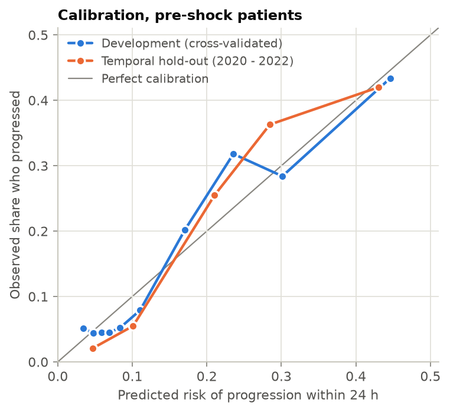
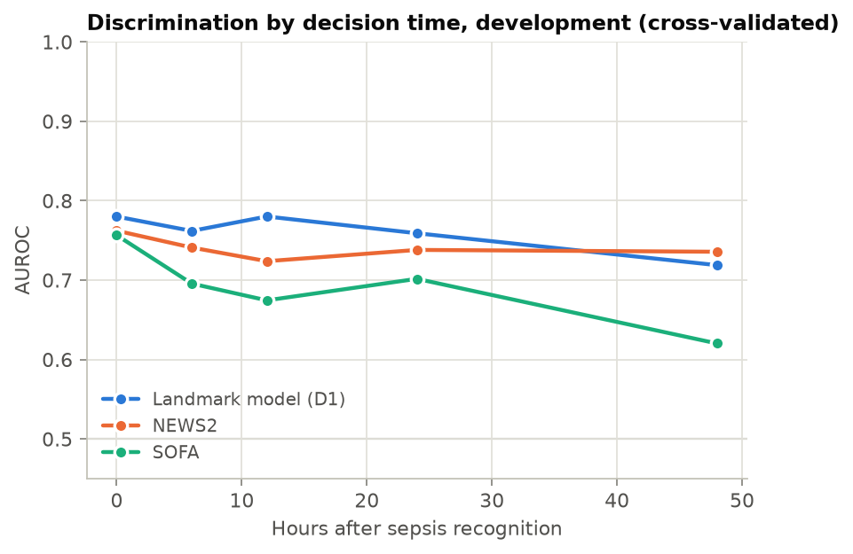
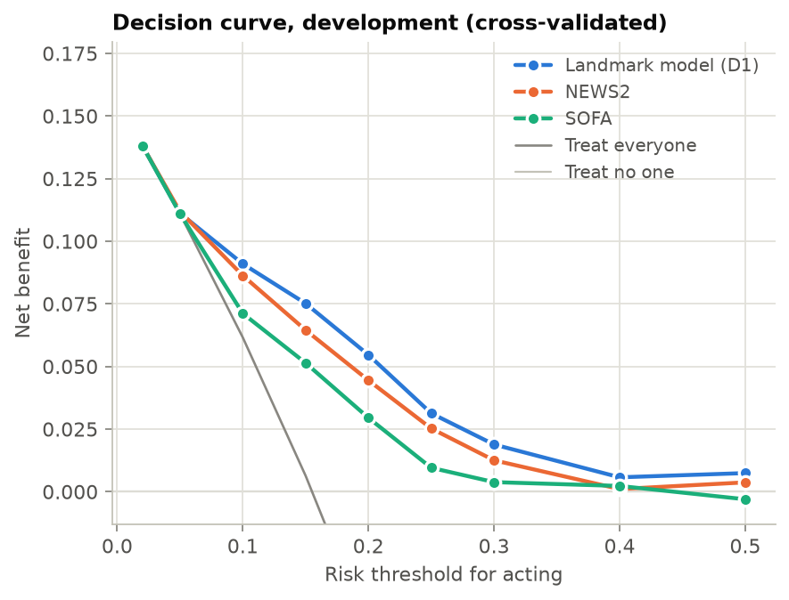
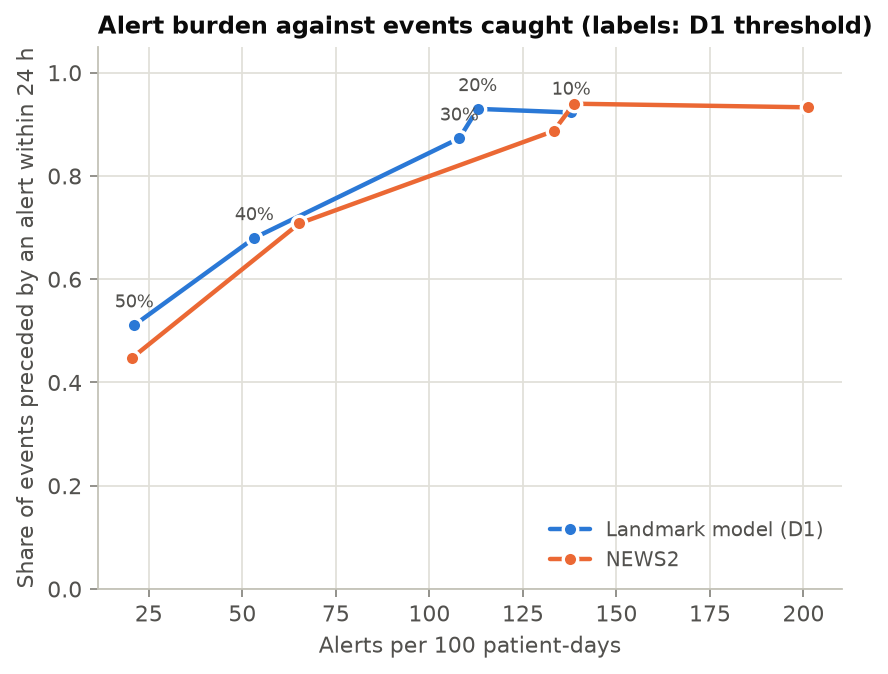
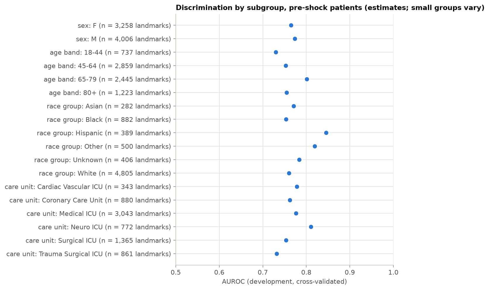
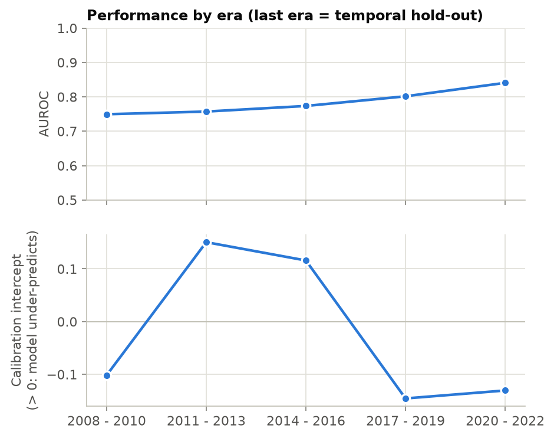

# Evaluation report

- Data: synthetic patients (no real data)
- Settings fingerprint: `78b4f1dcc63e`
- Horizon: 24 hours
- Cells below 11 are shown as `<11`; small bins and cohort steps are merged with their neighbours instead. In subgroup and era tables, `hidden` marks groups below 11 and the groups hidden with them so that a small group cannot be worked out from the total.
- Overall measures carry 95% patient-bootstrap intervals; results by decision time, subgroup and era are point estimates.

## Cohort

| Step | ICU stays remaining |
|---|---|
| ICU stays | 2,000 |
| ICU discharge time recorded | 2,000 |
| age >= 18 | 2,000 |
| first ICU stay of the patient | 1,729 |
| Sepsis-3 recognised during the ICU stay | 1,326 |
| recognised within 24 h of ICU admission; not on services CSURG, TSURG | 1,192 |

## Main result: pre-shock patients, next stage within the horizon

Calibration by tenth of predicted risk (the figure above):

| Split | Predicted range | Mean predicted | Observed |
|---|---|---|---|
| development cv | 0.5%–4.3% | 3.5% | 5.1% (37/727) |
| development cv | 4.3%–5.3% | 4.8% | 4.4% (32/727) |
| development cv | 5.3%–6.3% | 5.8% | 4.5% (33/727) |
| development cv | 6.3%–7.5% | 6.9% | 4.5% (33/727) |
| development cv | 7.5%–9.3% | 8.3% | 5.2% (38/726) |
| development cv | 9.3%–13.4% | 11.1% | 7.9% (57/726) |
| development cv | 13.4%–20.5% | 17.1% | 20.2% (147/726) |
| development cv | 20.5%–26.6% | 23.6% | 31.8% (231/726) |
| development cv | 26.6%–34.2% | 30.1% | 28.4% (206/726) |
| development cv | 34.2%–96.5% | 44.6% | 43.4% (315/726) |
| temporal holdout | 1.2%–6.7% | 4.7% | 2.1% (13/631) |
| temporal holdout | 6.7%–18.0% | 10.1% | 5.5% (26/471) |
| temporal holdout | 18.0%–24.4% | 21.0% | 25.5% (40/157) |
| temporal holdout | 24.4%–32.7% | 28.5% | 36.3% (57/157) |
| temporal holdout | 32.8%–93.9% | 43.0% | 42.0% (66/157) |

Calibration by fixed risk band (used on the screen):

| Split | Band | Decision points | Mean predicted | Observed |
|---|---|---|---|---|
| development cv | 0%–5% | 1,228 | 3.9% | 4.9% (60/1,228) |
| development cv | 5%–10% | 2,593 | 7.1% | 5.0% (130/2,593) |
| development cv | 10%–15% | 683 | 12.1% | 8.9% (61/683) |
| development cv | 15%–20% | 527 | 17.5% | 21.6% (114/527) |
| development cv | 20%–30% | 1,149 | 24.9% | 29.9% (343/1,149) |
| development cv | 30%–40% | 689 | 34.3% | 34.5% (238/689) |
| development cv | 40%–50% | 255 | 43.9% | 33.7% (86/255) |
| development cv | 50%–100% | 140 | 64.5% | 69.3% (97/140) |
| temporal holdout | 0%–10% | 927 | 5.8% | 2.0% (19/927) |
| temporal holdout | 10%–20% | 232 | 14.8% | 13.4% (31/232) |
| temporal holdout | 20%–30% | 209 | 24.9% | 32.5% (68/209) |
| temporal holdout | 30%–40% | 146 | 34.4% | 34.9% (51/146) |
| temporal holdout | 40%–100% | 59 | 54.8% | 55.9% (33/59) |

## Pre-shock patients (next stage = shock or death)

| Target | Split | Model | AUROC | AUPRC | Brier | Calibration slope | Calibration intercept | ICI | Observed rate |
|---|---|---|---|---|---|---|---|---|---|
| next stage within the horizon (X) | development cv | Landmark model (D1) | 0.769 (0.742–0.795) | 0.398 (0.358–0.441) | 0.112 (0.102–0.123) | 1.071 (0.947–1.218) | -0.003 (-0.138–0.127) | 0.014 (0.008–0.027) | 15.5% (1,129/7,264) |
| next stage within the horizon (X) | development cv | SOFA | 0.687 (0.651–0.726) | 0.280 (0.239–0.327) | 0.124 (0.111–0.136) | 0.988 (0.756–1.228) | 0.001 (-0.137–0.137) | 0.022 (0.013–0.038) | 15.5% (1,129/7,264) |
| next stage within the horizon (X) | development cv | NEWS2 | 0.742 (0.719–0.765) | 0.343 (0.310–0.381) | 0.117 (0.107–0.128) | 0.990 (0.882–1.099) | -0.000 (-0.143–0.130) | 0.022 (0.018–0.032) | 15.5% (1,129/7,264) |
| next stage within the horizon (X) | temporal holdout | Landmark model (D1) | 0.841 (0.789–0.889) | 0.470 (0.387–0.556) | 0.087 (0.071–0.108) | 1.480 (1.212–1.844) | -0.131 (-0.437–0.152) | 0.033 (0.022–0.054) | 12.8% (202/1,573) |
| next stage within the horizon (X) | temporal holdout | SOFA | 0.750 (0.693–0.805) | 0.286 (0.225–0.371) | 0.102 (0.082–0.129) | 1.578 (1.149–2.082) | -0.125 (-0.454–0.162) | 0.032 (0.023–0.062) | 12.8% (202/1,573) |
| next stage within the horizon (X) | temporal holdout | NEWS2 | 0.841 (0.805–0.886) | 0.425 (0.351–0.522) | 0.090 (0.073–0.112) | 1.648 (1.398–2.011) | -0.149 (-0.459–0.133) | 0.037 (0.023–0.062) | 12.8% (202/1,573) |
| next stage within the next hour (p1) | development cv | Landmark model (D1) | 0.948 (0.917–0.974) | 0.314 (0.216–0.439) | 0.006 (0.005–0.008) | 1.003 (0.878–1.195) | -0.001 (-0.309–0.264) | 0.002 (0.002–0.004) | 0.8% (56/7,264) |
| next stage within the next hour (p1) | development cv | SOFA | 0.794 (0.740–0.844) | 0.029 (0.019–0.050) | 0.008 (0.006–0.009) | 0.961 (0.756–1.185) | -0.004 (-0.271–0.217) | 0.002 (0.001–0.004) | 0.8% (56/7,264) |
| next stage within the next hour (p1) | development cv | NEWS2 | 0.891 (0.857–0.926) | 0.110 (0.062–0.201) | 0.007 (0.005–0.009) | 0.963 (0.811–1.175) | -0.005 (-0.280–0.204) | 0.002 (0.001–0.004) | 0.8% (56/7,264) |
| next stage within the next hour (p1) | temporal holdout | Landmark model (D1) | 0.901 (0.777–0.985) | 0.462 (0.144–0.736) | 0.005 (0.003–0.009) | 1.035 (0.670–1.650) | 0.066 (-0.573–0.547) | 0.006 (0.004–0.008) | 0.8% (12/1,573) |
| next stage within the next hour (p1) | temporal holdout | SOFA | 0.844 (0.699–0.958) | 0.088 (0.027–0.275) | 0.007 (0.004–0.011) | 1.633 (0.987–2.773) | 0.202 (-0.364–0.616) | 0.002 (0.001–0.005) | 0.8% (12/1,573) |
| next stage within the next hour (p1) | temporal holdout | NEWS2 | 0.900 (0.743–0.986) | 0.281 (0.090–0.555) | 0.007 (0.004–0.010) | 1.340 (0.701–2.251) | 0.213 (-0.345–0.614) | 0.003 (0.002–0.005) | 0.8% (12/1,573) |
| next stage within the horizon, starting one hour from now (Z) | development cv | Landmark model (D1) | 0.757 (0.722–0.788) | 0.358 (0.315–0.403) | 0.114 (0.102–0.124) | 1.058 (0.905–1.225) | -0.004 (-0.183–0.157) | 0.013 (0.007–0.032) | 15.3% (1,105/7,208) |
| next stage within the horizon, starting one hour from now (Z) | development cv | SOFA | 0.678 (0.638–0.711) | 0.268 (0.230–0.314) | 0.123 (0.110–0.134) | 0.988 (0.780–1.193) | 0.001 (-0.168–0.148) | 0.022 (0.010–0.036) | 15.3% (1,105/7,208) |
| next stage within the horizon, starting one hour from now (Z) | development cv | NEWS2 | 0.731 (0.701–0.763) | 0.317 (0.279–0.353) | 0.118 (0.105–0.129) | 0.991 (0.843–1.144) | -0.000 (-0.165–0.151) | 0.024 (0.019–0.034) | 15.3% (1,105/7,208) |
| next stage within the horizon, starting one hour from now (Z) | temporal holdout | Landmark model (D1) | 0.835 (0.783–0.877) | 0.436 (0.331–0.555) | 0.087 (0.068–0.109) | 1.538 (1.254–1.875) | -0.138 (-0.464–0.152) | 0.034 (0.026–0.058) | 12.5% (195/1,561) |
| next stage within the horizon, starting one hour from now (Z) | temporal holdout | SOFA | 0.738 (0.681–0.799) | 0.257 (0.185–0.353) | 0.102 (0.078–0.127) | 1.548 (1.081–2.149) | -0.142 (-0.486–0.144) | 0.033 (0.025–0.063) | 12.5% (195/1,561) |
| next stage within the horizon, starting one hour from now (Z) | temporal holdout | NEWS2 | 0.838 (0.794–0.872) | 0.394 (0.298–0.494) | 0.090 (0.070–0.112) | 1.728 (1.425–2.044) | -0.164 (-0.474–0.126) | 0.041 (0.031–0.063) | 12.5% (195/1,561) |
| death within 28 days | development cv | Landmark model (D1) | 0.607 (0.550–0.677) | 0.242 (0.202–0.289) | 0.138 (0.120–0.156) | 0.732 (0.392–1.176) | -0.004 (-0.210–0.206) | 0.017 (0.009–0.041) | 16.9% (1,228/7,264) |
| death within 28 days | development cv | SOFA | 0.586 (0.539–0.639) | 0.226 (0.186–0.277) | 0.138 (0.121–0.158) | 0.855 (0.412–1.319) | -0.001 (-0.207–0.205) | 0.010 (0.007–0.036) | 16.9% (1,228/7,264) |
| death within 28 days | development cv | NEWS2 | 0.609 (0.572–0.656) | 0.231 (0.193–0.280) | 0.138 (0.121–0.156) | 0.914 (0.614–1.306) | -0.002 (-0.204–0.201) | 0.016 (0.011–0.035) | 16.9% (1,228/7,264) |
| death within 28 days | temporal holdout | Landmark model (D1) | 0.572 (0.451–0.717) | 0.178 (0.114–0.278) | 0.102 (0.069–0.137) | 0.593 (-0.264–1.587) | -0.434 (-1.066–0.021) | 0.051 (0.025–0.097) | 11.3% (177/1,573) |
| death within 28 days | temporal holdout | SOFA | 0.611 (0.509–0.737) | 0.184 (0.111–0.287) | 0.100 (0.066–0.135) | 1.345 (0.188–2.616) | -0.424 (-1.042–0.029) | 0.050 (0.026–0.096) | 11.3% (177/1,573) |
| death within 28 days | temporal holdout | NEWS2 | 0.590 (0.487–0.719) | 0.170 (0.110–0.253) | 0.101 (0.068–0.135) | 0.874 (-0.082–2.030) | -0.443 (-1.087–0.008) | 0.051 (0.022–0.100) | 11.3% (177/1,573) |

## Patients on a vasopressor or after shock (next stage = death)

| Target | Split | Model | AUROC | AUPRC | Brier | Calibration slope | Calibration intercept | ICI | Observed rate |
|---|---|---|---|---|---|---|---|---|---|
| next stage within the horizon (X) | development cv | Landmark model (D1) | 0.650 (0.609–0.697) | 0.134 (0.102–0.174) | 0.084 (0.065–0.099) | 0.846 (0.612–1.152) | -0.005 (-0.323–0.208) | 0.013 (0.009–0.030) | 9.4% (330/3,499) |
| next stage within the horizon (X) | development cv | SOFA | 0.511 (0.456–0.564) | 0.093 (0.071–0.126) | 0.086 (0.066–0.101) | 0.495 (-0.276–1.393) | 0.004 (-0.298–0.216) | 0.017 (0.009–0.035) | 9.4% (330/3,499) |
| next stage within the horizon (X) | development cv | NEWS2 | 0.659 (0.626–0.688) | 0.143 (0.107–0.174) | 0.084 (0.065–0.099) | 0.926 (0.735–1.126) | -0.002 (-0.308–0.219) | 0.011 (0.007–0.027) | 9.4% (330/3,499) |
| next stage within the horizon (X) | temporal holdout | Landmark model (D1) | 0.550 (0.439–0.687) | 0.093 (0.037–0.197) | 0.066 (0.036–0.100) | 0.393 (-0.167–1.291) | -0.412 (-1.183–0.172) | 0.040 (0.023–0.068) | 6.8% (57/834) |
| next stage within the horizon (X) | temporal holdout | SOFA | 0.528 (0.367–0.647) | 0.072 (0.032–0.139) | 0.065 (0.036–0.100) | 0.670 (-1.639–3.244) | -0.399 (-1.190–0.142) | 0.030 (0.009–0.066) | 6.8% (57/834) |
| next stage within the horizon (X) | temporal holdout | NEWS2 | 0.601 (0.518–0.684) | 0.090 (0.048–0.156) | 0.065 (0.037–0.099) | 0.577 (0.144–1.107) | -0.426 (-1.206–0.136) | 0.035 (0.017–0.068) | 6.8% (57/834) |
| next stage within the next hour (p1) | development cv | Landmark model (D1) | 0.510 (0.345–0.635) | 0.005 (0.003–0.010) | 0.005 (0.003–0.007) | 0.091 (-0.316–0.525) | 0.014 (-0.508–0.493) | 0.003 (0.002–0.005) | 0.5% (16/3,499) |
| next stage within the next hour (p1) | development cv | SOFA | 0.303 (0.170–0.440) | 0.003 (0.002–0.006) | 0.005 (0.003–0.007) | -1.233 (-1.876–-0.331) | 0.006 (-0.551–0.487) | 0.003 (0.002–0.004) | 0.5% (16/3,499) |
| next stage within the next hour (p1) | development cv | NEWS2 | 0.536 (0.451–0.644) | 0.005 (0.003–0.010) | 0.005 (0.003–0.007) | 0.383 (0.062–1.070) | 0.006 (-0.543–0.476) | 0.002 (0.001–0.004) | 0.5% (16/3,499) |
| next stage within the next hour (p1) | temporal holdout | Landmark model (D1) | too few events | too few events | too few events | too few events | too few events | too few events | <11 |
| next stage within the next hour (p1) | temporal holdout | SOFA | too few events | too few events | too few events | too few events | too few events | too few events | <11 |
| next stage within the next hour (p1) | temporal holdout | NEWS2 | too few events | too few events | too few events | too few events | too few events | too few events | <11 |
| next stage within the horizon, starting one hour from now (Z) | development cv | Landmark model (D1) | 0.641 (0.590–0.675) | 0.130 (0.098–0.165) | 0.084 (0.069–0.103) | 0.915 (0.593–1.168) | -0.003 (-0.276–0.265) | 0.013 (0.008–0.031) | 9.4% (327/3,483) |
| next stage within the horizon, starting one hour from now (Z) | development cv | SOFA | 0.505 (0.446–0.562) | 0.091 (0.069–0.123) | 0.085 (0.069–0.105) | 0.391 (-0.464–1.243) | 0.005 (-0.258–0.268) | 0.017 (0.009–0.033) | 9.4% (327/3,483) |
| next stage within the horizon, starting one hour from now (Z) | development cv | NEWS2 | 0.658 (0.624–0.687) | 0.143 (0.113–0.178) | 0.083 (0.068–0.103) | 0.921 (0.713–1.098) | -0.002 (-0.282–0.249) | 0.010 (0.007–0.028) | 9.4% (327/3,483) |
| next stage within the horizon, starting one hour from now (Z) | temporal holdout | Landmark model (D1) | 0.537 (0.412–0.675) | 0.088 (0.031–0.181) | 0.063 (0.033–0.094) | 0.315 (-0.354–1.215) | -0.458 (-1.367–0.058) | 0.041 (0.027–0.071) | 6.5% (54/830) |
| next stage within the horizon, starting one hour from now (Z) | temporal holdout | SOFA | 0.528 (0.394–0.680) | 0.070 (0.030–0.129) | 0.062 (0.032–0.091) | 0.669 (-1.303–4.830) | -0.444 (-1.348–0.038) | 0.033 (0.013–0.071) | 6.5% (54/830) |
| next stage within the horizon, starting one hour from now (Z) | temporal holdout | NEWS2 | 0.591 (0.485–0.705) | 0.086 (0.040–0.152) | 0.063 (0.034–0.093) | 0.520 (0.004–1.195) | -0.474 (-1.392–0.032) | 0.039 (0.019–0.072) | 6.5% (54/830) |
| death within 28 days | development cv | Landmark model (D1) | 0.567 (0.518–0.614) | 0.399 (0.336–0.471) | 0.230 (0.214–0.246) | 0.521 (0.120–0.923) | -0.008 (-0.248–0.233) | 0.029 (0.019–0.072) | 36.0% (1,258/3,499) |
| death within 28 days | development cv | SOFA | 0.515 (0.463–0.562) | 0.366 (0.295–0.442) | 0.230 (0.217–0.245) | 0.500 (-0.490–1.532) | -0.000 (-0.236–0.241) | 0.024 (0.018–0.070) | 36.0% (1,258/3,499) |
| death within 28 days | development cv | NEWS2 | 0.572 (0.536–0.610) | 0.396 (0.339–0.451) | 0.228 (0.213–0.243) | 0.750 (0.236–1.187) | -0.002 (-0.231–0.243) | 0.023 (0.018–0.066) | 36.0% (1,258/3,499) |
| death within 28 days | temporal holdout | Landmark model (D1) | 0.563 (0.490–0.638) | 0.364 (0.232–0.486) | 0.225 (0.195–0.253) | 0.567 (-0.027–1.292) | -0.105 (-0.677–0.312) | 0.043 (0.033–0.135) | 34.2% (285/834) |
| death within 28 days | temporal holdout | SOFA | 0.594 (0.505–0.690) | 0.415 (0.253–0.560) | 0.222 (0.192–0.249) | 2.701 (0.296–5.913) | -0.111 (-0.693–0.284) | 0.050 (0.026–0.148) | 34.2% (285/834) |
| death within 28 days | temporal holdout | NEWS2 | 0.571 (0.510–0.629) | 0.393 (0.261–0.510) | 0.223 (0.193–0.248) | 0.862 (0.143–1.650) | -0.110 (-0.712–0.289) | 0.029 (0.013–0.143) | 34.2% (285/834) |

## Discrimination by decision time

| Hours after recognition | D1 | NEWS2 | SOFA |
|---|---|---|---|
| 0 | 0.780 | 0.762 | 0.756 |
| 6 | 0.762 | 0.741 | 0.696 |
| 12 | 0.780 | 0.724 | 0.674 |
| 24 | 0.759 | 0.738 | 0.702 |
| 48 | 0.719 | 0.736 | 0.620 |

## Decision curve

| Threshold | D1 | NEWS2 | SOFA | Treat everyone |
|---|---|---|---|---|
| 2% | 0.1383 | 0.1382 | 0.1382 | 0.1382 |
| 5% | 0.1112 | 0.1119 | 0.1110 | 0.1110 |
| 10% | 0.0910 | 0.0863 | 0.0712 | 0.0616 |
| 15% | 0.0751 | 0.0645 | 0.0514 | 0.0064 |
| 20% | 0.0546 | 0.0445 | 0.0295 | -0.0557 |
| 25% | 0.0313 | 0.0252 | 0.0095 | -0.1261 |
| 30% | 0.0188 | 0.0125 | 0.0038 | -0.2065 |
| 40% | 0.0057 | 0.0011 | 0.0023 | -0.4076 |
| 50% | 0.0074 | 0.0037 | -0.0030 | -0.6892 |

## Alert burden (hourly scoring of pre-shock patients)

### Development cv

| Model | Threshold | Alerts per 100 patient-days | PPV | Sensitivity | Alerts per detected event | Lead time, h (quartiles) |
|---|---|---|---|---|---|---|
| Landmark model (D1) | 10% | 137.9 | 18.2% (302/1,660) | 92.3% (262/284) | 6.3 | 4.7 / 11.4 / 16.9 |
| Landmark model (D1) | 20% | 112.9 | 30.9% (420/1,359) | 93.0% (264/284) | 5.1 | 4 / 11.1 / 17 |
| Landmark model (D1) | 30% | 108.0 | 36.8% (478/1,300) | 87.3% (248/284) | 5.2 | 2.8 / 10.3 / 17.8 |
| Landmark model (D1) | 40% | 53.2 | 46.6% (299/641) | 68.0% (193/284) | 3.3 | 1.3 / 3.6 / 14.7 |
| Landmark model (D1) | 50% | 21.1 | 68.1% (173/254) | 51.1% (145/284) | 1.8 | 0.8 / 1.6 / 4.7 |
| NEWS2 | 10% | 201.2 | 14.5% (352/2,422) | 93.3% (265/284) | 9.1 | 6.4 / 12.8 / 17.9 |
| NEWS2 | 20% | 138.7 | 30.3% (506/1,670) | 94.0% (267/284) | 6.3 | 5.5 / 12.5 / 18.9 |
| NEWS2 | 30% | 133.2 | 35.3% (567/1,604) | 88.7% (252/284) | 6.4 | 3.5 / 11.5 / 19 |
| NEWS2 | 40% | 65.2 | 39.1% (307/785) | 70.8% (201/284) | 3.9 | 1.7 / 5.3 / 13 |
| NEWS2 | 50% | 20.4 | 58.8% (144/245) | 44.7% (127/284) | 1.9 | 0.9 / 2.2 / 7.3 |

### Temporal holdout

| Model | Threshold | Alerts per 100 patient-days | PPV | Sensitivity | Alerts per detected event | Lead time, h (quartiles) |
|---|---|---|---|---|---|---|
| Landmark model (D1) | 10% | 127.9 | 19.7% (66/335) | <11 | 5.8 | 3.7 / 9.8 / 16.9 |
| Landmark model (D1) | 20% | 104.6 | 35.8% (98/274) | <11 | 4.7 | 3.4 / 9.6 / 17 |
| Landmark model (D1) | 30% | 97.0 | 40.6% (103/254) | <11 | 4.8 | 2.8 / 8.3 / 17.3 |
| Landmark model (D1) | 40% | 47.0 | 45.5% (56/123) | 72.6% (45/62) | 2.7 | 1.7 / 3.4 / 8.3 |
| Landmark model (D1) | 50% | 14.9 | <11 | 50.0% (31/62) | 1.3 | 0.9 / 2.3 / 4.1 |
| NEWS2 | 10% | 215.0 | 13.5% (76/563) | <11 | 9.4 | 4.7 / 11 / 19.7 |
| NEWS2 | 20% | 125.2 | 35.1% (115/328) | <11 | 5.6 | 3.9 / 13.1 / 18.8 |
| NEWS2 | 30% | 111.5 | 39.4% (115/292) | <11 | 5.3 | 3 / 13.1 / 18.2 |
| NEWS2 | 40% | 37.4 | 46.9% (46/98) | 62.9% (39/62) | 2.5 | 1.2 / 2.7 / 6.5 |
| NEWS2 | 50% | 19.5 | 64.7% (33/51) | 46.8% (29/62) | 1.8 | 1.5 / 2.8 / 4.5 |

## Subgroups

| Group | Rows | Observed rate | AUROC | Calibration intercept |
|---|---|---|---|---|
| sex: F | 3,258 | 16.2% (529/3,258) | 0.765 | 0.009 |
| sex: M | 4,006 | 15.0% (600/4,006) | 0.773 | -0.012 |
| age band: 18-44 | 737 | 11.1% (82/737) | 0.730 | -0.409 |
| age band: 45-64 | 2,859 | 14.8% (424/2,859) | 0.753 | -0.028 |
| age band: 65-79 | 2,445 | 16.4% (402/2,445) | 0.801 | 0.082 |
| age band: 80+ | 1,223 | 18.1% (221/1,223) | 0.755 | 0.089 |
| race group: Asian | 282 | 11.0% (31/282) | 0.771 | -0.642 |
| race group: Black | 882 | 13.5% (119/882) | 0.753 | -0.038 |
| race group: Hispanic | 389 | 19.3% (75/389) | 0.846 | 0.229 |
| race group: Other | 500 | 15.2% (76/500) | 0.820 | 0.043 |
| race group: Unknown | 406 | 16.3% (66/406) | 0.784 | -0.055 |
| race group: White | 4,805 | 15.9% (762/4,805) | 0.760 | 0.017 |
| care unit: Cardiac Vascular ICU | 343 | 11.1% (38/343) | 0.778 | -0.253 |
| care unit: Coronary Care Unit | 880 | 20.1% (177/880) | 0.762 | 0.236 |
| care unit: Medical ICU | 3,043 | 15.3% (467/3,043) | 0.776 | -0.047 |
| care unit: Neuro ICU | 772 | 10.2% (79/772) | 0.810 | -0.374 |
| care unit: Surgical ICU | 1,365 | 15.0% (205/1,365) | 0.753 | 0.022 |
| care unit: Trauma Surgical ICU | 861 | 18.9% (163/861) | 0.732 | 0.171 |

## Drift by era

| Era | Rows | Observed rate | AUROC | Calibration intercept |
|---|---|---|---|---|
| 2008 - 2010 | 1,807 | 15.4% (279/1,807) | 0.749 | -0.102 |
| 2011 - 2013 | 1,749 | 16.1% (282/1,749) | 0.757 | 0.151 |
| 2014 - 2016 | 1,731 | 16.4% (284/1,731) | 0.773 | 0.116 |
| 2017 - 2019 | 1,977 | 14.4% (284/1,977) | 0.802 | -0.146 |
| 2020 - 2022 | 1,573 | 12.8% (202/1,573) | 0.841 | -0.131 |

